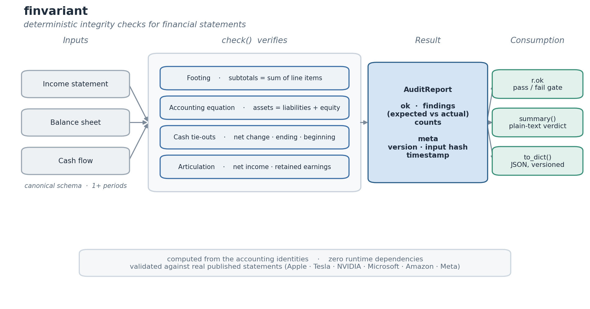

# finvariant

[](https://github.com/arikanatakan/finvariant/actions/workflows/ci.yml)
[](https://pypi.org/project/finvariant/)
[](LICENSE)

Deterministic integrity checks for financial statements.

Give finvariant income statement, balance sheet and cash flow data; it verifies
the accounting invariants - the balance sheet balances, the cash flow ties to
the balance sheet, subtotals foot, and the three statements articulate - and
returns a structured, auditable report. It verifies; it does not parse, fetch
or build statements.



## Motivation

Python has plenty of libraries to *retrieve* statements (financetoolkit, the SEC
tools) and to *build* models (DCF templates, FP&A scripts). What none of them do
is *check that a set of statements or a model is internally consistent*: that
assets equal liabilities plus equity, that the cash flow's ending cash matches
the balance sheet, that retained earnings roll forward by net income less
dividends, that every subtotal foots. That check is exactly what a spreadsheet
silently gets wrong - and surveys put an error in the large majority of business
spreadsheets.

finvariant encodes those invariants as deterministic, testable rules. The same
thing a large language model cannot be trusted to get right (consistent
arithmetic across linked statements), a small library can guarantee. Every
result is one report: a verdict, the exact failing checks with expected vs
actual, and provenance, so a verification can be reproduced and audited later.

```
pip install finvariant
```

No runtime dependencies.

## Usage

Catch an error:

```python
import finvariant as fv

s = fv.Statements(
    periods=["FY2024"],
    balance_sheet={"FY2024": {
        "total_assets": 540,          # should be 538
        "total_liabilities": 158,
        "total_equity": 380,
    }},
)

r = fv.check(s)
r.ok            # False
print(r.summary())
# finvariant audit - 2026-...
#   1 checks run, 0 passed, 1 failed, 0 skipped
#   [ERROR] EQ.accounting_equation assets = liabilities + equity (FY2024): expected 538, got 540, off by 2
# Verdict: FAIL - statements do not tie out
```

Real statements tie out. Apple FY2024 from the 10-K is shown below. The
validation suite checks six real companies (Apple, Tesla, NVIDIA, Microsoft,
Amazon, Meta), ranging from full line-item footing to subtotal-only data, where
a check whose inputs are missing is skipped rather than failed.

```python
s = fv.Statements(
    periods=["FY2024"],
    income_statement={"FY2024": {
        "revenue": 391035, "cogs": 210352, "gross_profit": 180683,
        "operating_expenses": 57467, "operating_income": 123216,
        "other_income": 269, "pretax_income": 123485, "tax": 29749,
        "net_income": 93736,
    }},
    balance_sheet={"FY2024": {
        "total_current_assets": 152987, "total_non_current_assets": 211993,
        "total_assets": 364980,
        "total_current_liabilities": 176392, "total_non_current_liabilities": 131638,
        "total_liabilities": 308030,
        "common_stock": 83276, "retained_earnings": -19154,
        "accumulated_oci": -7172, "total_equity": 56950,
    }},
)
fv.check(s).ok          # True
```

The report carries named findings, counts, `ok`, `summary()` and a JSON-safe
`to_dict()` with provenance (version, input hash, timestamp).

## What it checks

| Group | Invariant |
|-------|-----------|
| Footing | every subtotal equals the sum of its line items (all three statements) |
| Equation | total assets = total liabilities + total equity |
| Cash | net change = cfo + cfi + cff; ending cash ties to the balance sheet; beginning cash ties to the prior period |
| Articulation | net income agrees across statements; retained earnings roll forward by net income less dividends |

Provide only the fields you have: a check whose inputs are missing is reported
as skipped, never failed. Tolerances absorb the rounding in statements reported
in whole millions.

## Status

Version 0.1.0. Single entity, single currency, one or more periods, in a
canonical schema. The `Statements` input and `AuditReport` output are the
contract and are append-only from here.

## Known limitations

The retained-earnings roll-forward checks `retained earnings = prior + net
income - dividends`. It does not yet model share buybacks charged to retained
earnings, which several large companies do (Microsoft, for example). For those,
supply the balance sheet without the retained-earnings line so the roll-forward
is skipped rather than falsely failed; a full equity roll-forward is planned for
0.2.

Footing compares a subtotal to the line items you supply, so give a section's
items in full or not at all: a partial section is reported as not footing.

## Roadmap

| Version | Scope |
|---------|-------|
| 0.2 | roll-forward checks (PP&E = opening + capex - depreciation - disposals; debt; equity); working-capital changes reconciled to operating cash flow |
| 0.3 | an MCP server so an agent can verify financial statements it reads or generates |
| 0.4 | optional readers to map common export formats into the canonical schema |

Out of scope: retrieving statements (see financetoolkit, the SEC tools),
building or forecasting models, ratio analysis, consolidation and currency
translation.

## References

### Data sources

The real statements in the validation suite are the companies' own figures as
reported in their U.S. SEC Form 10-K filings. They were compiled from the public
filings and cross-checked for internal consistency (footing and the accounting
equation). All filings are on [SEC EDGAR](https://www.sec.gov/edgar).

| Company | Filing | Fiscal year ended |
|---------|--------|-------------------|
| Apple Inc. | Form 10-K | September 28, 2024 |
| Tesla, Inc. | Form 10-K | December 31, 2024 |
| NVIDIA Corporation | Form 10-K | January 26, 2025 |
| Microsoft Corporation | Form 10-K | June 30, 2024 and June 30, 2023 |
| Amazon.com, Inc. | Form 10-K | December 31, 2024 |
| Meta Platforms, Inc. | Form 10-K | December 31, 2024 |

### Method

The checks are the standard accounting identities: the accounting equation
(assets = liabilities + equity), the footing of subtotals, the cash-flow
identity (net change = operating + investing + financing) and the articulation
of the three statements (net income and retained earnings linking the income
statement, balance sheet and cash flow). These follow the conceptual frameworks
of the FASB and IASB and standard financial-accounting texts.

## License

MIT. Written and maintained by [Atakan Arikan](https://github.com/arikanatakan),
MSc Student at Tsinghua University and Politecnico di Milano.
